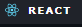

<h1 align="center"> Olá, meu nome é Thais. 
  Bem Vindo ao meu GitHub! 👋</h1>

 ⚡  Sou aprendiz de desenvolvimento front-end e back-end mas atualmente com ênfase no front-end. Pretendo ser full-stack e aqui quero compartilhar com vocês meu aprendizado, projetos, e muito mais! 
 

  

  

  
  
  
  
 ### Acesse meu Linkedin!
 
 

  
  
 

  <a href="https://github.com/cintrathais">
  
  

